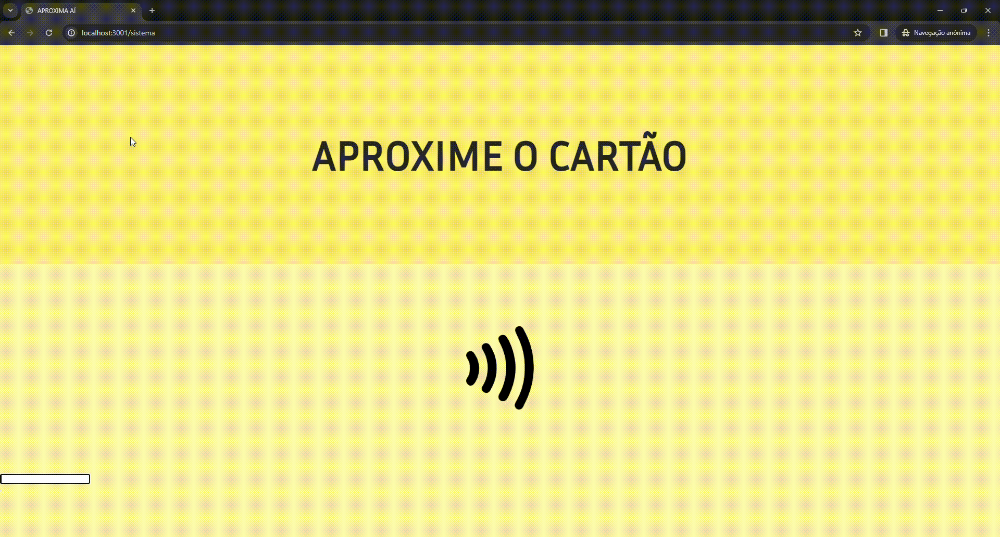

# 💾 Projeto Integrador:   Sistema de Ônibus - Grupo 8

<h1 align="center">Site Publico</h1>
A função do site publico é que o proprio usuário possa fazer seu cadastro , sua recarga por meio do cpf, vizualizar o horário das linhas e dar sugestões  ou reclamações por meio da página sobre, que esta interligada com o site administrativo
<br><br>
<p align="center">
  
</p>

<h1 align="center">Sistema de catraca</h1>
A função do sistema de catraca é que ao passar o numero do cartão o usuario seja redirecionado para uma tela de aprovado(onde vai receber a mensagem "Boa Viagem (nome do usuario) e o saldo restante " ou sera redirecionado para uma tela de erro(onde vai receber uma mensagem de erro relacionada ao problema como "saldo insuficiente" , "cartão não encontrado" , etc). Existem quatro tipos de usuários, comum(paga 5 em cada passagem), idoso e deficiente(passagens grátis ilimitadas) e estudante(duas passagens gratis por dia e após gastá-las paga 5 por passagem)
<br><br>
<p align="center">
  
</p>

## 🛠 Construído com:

- JavaScript<br>
- Node.js<br>
- EJS<br>
- SCSS<br>
- CSS<br>
- DataTables<br>
- Chart.js<br>
- Axios<br>
- Prisma<br>
- Bootstrap<br>
- Express.js<br>
- Bcryptjs<br>
- Cors<br>
- JsonWebToken<br>

## ⚙ Configuração do Ambiente:

- Terminal 1:<br>
```bash
 cd frontend
```
```bash
 npm install
```
```bash
 npm run dev
```
<br>

- Terminal 2:<br> 
```bash
 cd backend
```
```bash
 npm install
```
```bash
 npm run dev
```
para acessar as rotas do frontend você precisa ligar o xamp e modificar o arquivo .env(que esta dentro de backend) para a porta que ira usar e criar o banco de dados usando o arquivo "onbus.sql"(que esta dentro da pasta "doc"), depois disso pode acessar as rotas usando:

- Site Adm : <br>
                     - http://localhost:3001/ -> para o index <br>
                     - http://localhost:3001/ a pagina que deseja acessar <br>

- Site : <br>
                     - http://localhost:3001/site ->para o index <br>
                     - http://localhost:3001/site/ a pagina que deseja acessar <br>

- Interface Onibus: <br>
                     - http://localhost:3001/sistema ->para o index <br>
                     - http://localhost:3001/sistema/ a pagina que deseja acessar <br>


                    
## 📜 Autores:
    
- Luis Eduardo  - <luis0202.eduardo@gmail.com>
- Gabriel Teixeira  - <gabrielteixeiracorrea5@gmail.com>
   <br>
   <br>
IFSP - Campus Caraguatatuba - Brasil

